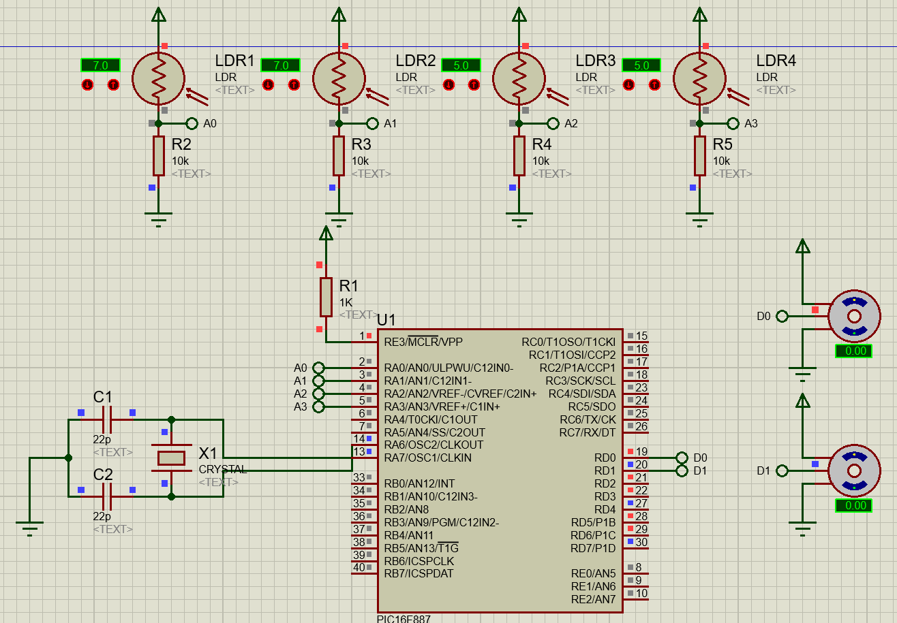
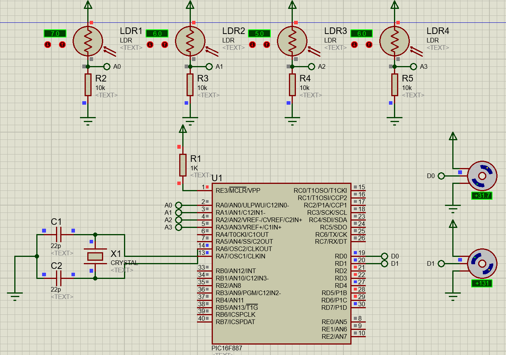

# Microcontroller-Based Servo Motor Control

This project provides control for a two-axis servo motor using a PIC microcontroller. It is written in CCS C and operates in the Proteus simulation environment.

## Project Description

This project utilizes a PIC microcontroller, such as PIC16F887, to control a two-axis servo motor. The system employs two Light Dependent Resistors (LDRs) to measure ambient light levels, and the servo motors respond accordingly.

## Requirements

To run this project, you'll need the following tools:

- CCS C Compiler: [CCS C Download Page](https://www.ccsinfo.com/ccsfreedemo.php)
- Proteus Simulation Environment: [Proteus Download Page](https://www.labcenter.com/downloads/)

## Installation

1. Download and install the CCS C compiler.
2. Download and install the Proteus Simulation Environment.
3. Clone the project to your computer or download it as a ZIP file.
4. Compile the project with CCS C to obtain the HEX file.
5. Open the project in the Proteus Simulation Environment and upload the HEX file to the microcontroller.
6. Start the simulation to observe the servo motors responding to ambient light levels.

## Simulations

### Initial state

### Secondary state

The difference in LDR values is reflected in the motors and allows them to move precisely.

## Directory Structure

The project directory is structured as follows:

- **/src:** C source code and CCS project files
- **/proteus:** Proteus simulation files
